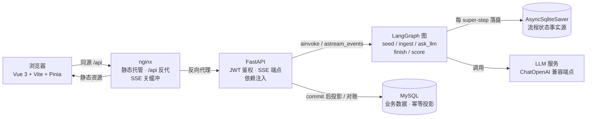

# AI 模拟面试系统

一个从零构建的全栈 AI 面试应用：LangGraph 状态机编排多角色 Agent，SSE 逐字流式输出，Checkpointer 断点续聊，一条 `docker compose up` 起全栈。

## ✨ 项目亮点

- **LangGraph 状态机编排**：面试流程（追问 / 结束 / 评分）声明式建模为图——`route_entry` 分流 → `ingest` 记账 → 条件路由 → `ask_llm` 追问 → `finish` → `score` 总评。图管流程、service 管事务，职责分离。
- **Checkpointer 断点续聊**：`AsyncSqliteSaver` 在每个 super-step 后自动落盘对话状态；服务重启后同一 `thread_id` 从 checkpoint 恢复，轮次无缝接续。业务库降级为**幂等投影**（`sync_projection` 对账补行），数据流单向、可重建。
- **SSE 逐字流式**：`astream_events` 捕获 ChatOpenAI token 流，按 `langgraph_node` 过滤（评分节点的内部产出不外流）；错误双通道——流前抛真 HTTP 状态码（404/409），流中发 `error` 事件帧。
- **容器化一键部署**：双 Dockerfile（多阶段构建）+ nginx 反代（resolver 动态解析防 502、SSE 关缓冲三行、SPA 回落 + 资源缓存三分法）+ compose 编排，数据卷持久化 MySQL 与 checkpoint。
- **工程纪律**：全量钉版本依赖、契约先行（TS 类型与后端 schema 同步演进）、pytest 12 条契约测试、同源化 `/api` 前缀（开发态 vite 代理 / 生产态 nginx 反代）。

## 🏗️ 架构



**核心设计——三次主权交接：**

| 状态 | 归属 | 说明 |
|---|---|---|
| 流程位置（轮次 / 历史 / 总评） | **Checkpoint** | 事实源可写，重启可恢复 |
| 业务记录（用户 / 会话归属 / 展示） | **MySQL** | 投影只读、幂等可重建，永不反向喂图 |
| 接口契约 | **TS 类型 ↔ Pydantic schema** | 前后端同屏演进 |

## 🛠️ 技术栈

| 层 | 技术 |
|---|---|
| 后端 | Python 3.13 · FastAPI（全异步）· SQLAlchemy 2.0（asyncmy）· Pydantic v2 |
| Agent 编排 | LangGraph · LangChain ChatOpenAI |
| 持久化 | MySQL 8 · AsyncSqliteSaver（checkpointer） |
| 鉴权 | OAuth2 Bearer · PyJWT（HS256）· bcrypt |
| 前端 | Vue 3 · TypeScript · Vite · Pinia · Vue Router |
| 部署 | Docker（多阶段构建）· nginx 反向代理 · docker compose |
| 测试 | pytest + pytest-asyncio（契约测试，依赖注入隔离） |

## 🚀 快速启动

```bash
# 1. 克隆
git clone <repo-url> && cd agents-interview

# 2. 在根目录创建 .env（容器编排用，不进 git）
cat > .env <<'EOF'
MYSQL_ROOT_PASSWORD=换成强口令
JWT_SECRET=换成随机串   # python -c "import secrets; print(secrets.token_hex(32))"
LLM_API_KEY=你的_key
LLM_BASE_URL=https://your-openai-compatible-endpoint/v1
LLM_MODEL=qwen1.5-72b-chat
EOF

# 3. 一条命令起全栈（首次构建需拉取基础镜像）
docker compose up -d --build

# 4. 浏览器打开 http://localhost:8080 —— 注册 → 登录 → 开始面试
```

容器拓扑：`nginx(8080) → FastAPI(容器内 8000，宿主机 18000 仅供调试) → MySQL(容器网络内，不暴露宿主机)`。

## 💻 本地开发

```bash
# 后端：Python 3.13 venv + backend/.env（DATABASE_URL 指向 localhost:3306）
uvicorn app.main:app --reload          # Swagger: http://127.0.0.1:8000/docs

# 前端：Node 22
npm ci && npm run dev                  # vite 代理 /api → 127.0.0.1:8000

# 测试（12 条契约测试，独立测试库，不依赖运行中的服务）
cd backend && pytest -q
```

## 📡 API 一览

| 方法 | 路径 | 说明 |
|---|---|---|
| POST | `/api/users` | 注册（201） |
| POST | `/api/users/login` | 登录（JSON）→ JWT |
| POST | `/api/users/token` | OAuth2 表单端点（Swagger Authorize 用） |
| GET | `/api/users/me` | 当前用户 |
| POST | `/api/interview` | 开新面试：LLM 出第一题（201） |
| GET | `/api/interview` | 历史面试列表 |
| GET | `/api/interview/{id}` | 会话详情（含消息与总评） |
| POST | `/api/interview/{id}/answer` | **SSE 流式**：`token` 逐字 → `end` 全量收尾 / `error` |
| POST | `/api/interview/{id}/finish` | 手动结束：即时生成总评 |
| GET | `/health` | 容器健康检查（根级，不走反代） |

## 📁 项目结构

```
agents-interview/
├── docker-compose.yml          # MySQL + backend + frontend 三服务编排
├── backend/
│   ├── Dockerfile              # 依赖层缓存优先的多阶段镜像
│   ├── app/
│   │   ├── agents/             # LangGraph：InterviewTurnState / 节点 / 编译图
│   │   ├── api/                # 路由层（SSE 编码在这里）
│   │   ├── services/           # 业务层（事务、投影对账、流式生成器）
│   │   ├── models/             # SQLAlchemy 异步模型
│   │   ├── schemas/            # Pydantic 契约
│   │   ├── core/               # config / db / security / llm / log
│   │   └── main.py             # lifespan：建表自举 + checkpointer 生命周期
│   └── tests/                  # 12 条契约测试
└── frontend/
    ├── Dockerfile              # node 构建 → nginx 托管（两段式）
    ├── nginx.conf              # SPA 回落 / 缓存三分法 / resolver 反代 / SSE 关缓冲
    └── src/                    # Vue3 + TS：api / stores / router / views
```

## 📸 界面

> 待补充：登录页 / 流式面试对话 / 总评卡片 / 关于页 截图

## 📄 License

MIT
